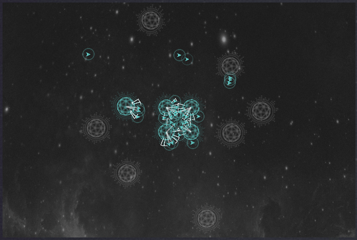

# halite2
Final submission for the Halite II contest. Final rank: 591

The approach I chose was straightforward. There was a priority list that determined for each friendly ship, based on it's current task and nearby entities (planets and enemies) how it should act in the next turn. It included some basic notion of defensive and offensive action, and of course took locality/distance into account.

Below you can see an overview of 4 of my matches that took place towards the end of the bracket. Still quite a few coding logic errors that I noticed but didn't choose or manage to fix. Nevertheless I was still quite happy with the result.

# Match 2 players - Purple

# Match 2 players - Blue

# Match 4 players - Blue

# Match 4 players - Yellow

